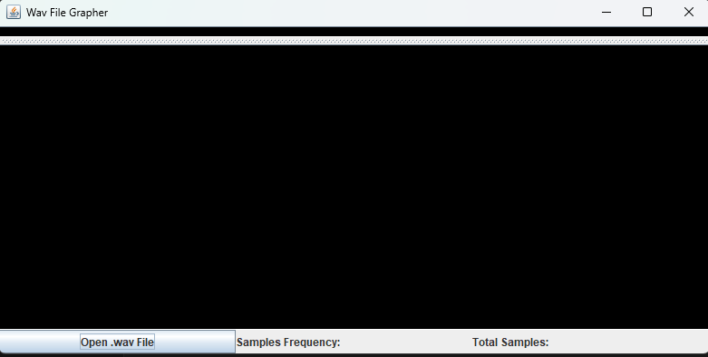
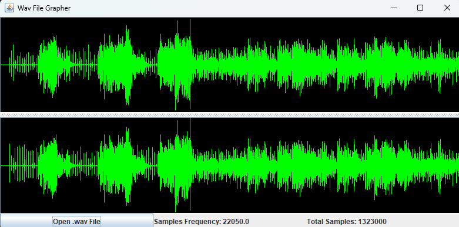

# Wav_file_Display

## Running the Application
Before running the application you need to downlaod Java on your computer if its not already downloaded. You can find the download for java [here](https://www.oracle.com/ca-en/java/technologies/downloads/)

Double click the `WAVgrapher-1.0.jar` to run the application.

The Graphical User Interface will open and you can use the `Open .wav file` button to open a .wav file to display it as a graph.

Example of BabyElephantWalk60.wav
